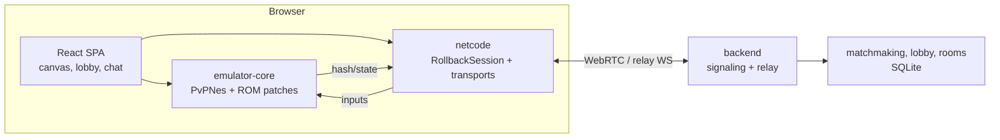

> 🌐 **English** · [Русский](README.md)

# Battle City PvP

> Online multiplayer for Battle City (NES)

A cooperative-competitive version of the classic **Battle City (NES)**: the team of
**defenders** (2 tanks) defends the headquarters against the team of **attackers** (up to 6 tanks),
played by real players or AI. The netplay is built on deterministic
**rollback-netcode** and runs in the browser (WebRTC, with a relay fallback).

The **jsnes** emulator and the original ROM are treated as immutable components:
- jsnes is included as a git submodule and is not edited — only subclasses/wrappers;
- the ROM is loaded as-is, and PvP logic is added by patches **in memory**, without modifying the file.

## Features

- Online matches **1v1, 2v2 and up to 8 players** (2 DEF + 6 ATT), full-mesh transport network.
- **Rollback-netcode** (GGPO approach): prediction, rollback, desync detection.
- **Reconnect** into an ongoing match, pause/resume, `desync-recovery` from a snapshot.
- Lobby: creation by code, team slots, ready, auto-start, kick, chat (SQLite history).
- **Spectator**: watch a match via the link `?spectate=MATCHID`.
- **AI** for attackers/defenders (plan / scan / lookahead / strategy) for solo play and filling slots.
- In-battle chat, connection HUD (ping, rollback, DESYNC), end of match with return to the lobby.
- **Stage selection (1–35) with preview** and **defender starting stars (0–3)** — from the ROM in memory, deterministic start.
- **Optional patch-features** (the first is "Pistol": a power-up and the 4th star grant a super-weapon) — the host/solo player chooses a set, all clients build the same ROM; features have **configurable parameters** with auto-UI and validation; see `docs/optional-patches.md`.
- **Solo "Tower Defence" mode** (hidden `tower-defence` feature): buying/placing stationary tower tanks for points, enemy waves, economy and a placement editor on TD maps; see `docs/tower-defense.md`.
- **Render drivers and extensions** (a layer separate from patches): a pixelated NES look, a **top-down 3D view** and a **voxel "sandbox" view** (cubic blocks, pixel textures, sky/day-night, water, particles, a "living world" — birds, blocky clouds, mice). Cameras: **orbit**, **third-person**, **first-person** (with auto-turn following the tank), settings/presets for each driver, live level preview before start. Extensions — minimap, particles. The choice is local and does not affect the match/determinism; see `docs/render-extensions.md`.
- **Sound and music** from the APU (jsnes) with separate volume/mute for music and effects; rollbacks do not cause clicks.
- Deterministic `saveState/loadState` and `getFrameHash` — the basis for wins/losses and netcode.

## Architecture



Key invariants:
- **Determinism**: same input → same state and `getFrameHash()` on every frame.
- **Immutable jsnes**: upstream in `vendor/jsnes`, generated copy `emulator-core/src`, guard test.
- **Immutable ROM**: patches are applied to the in-memory PRG image (see `docs/rom-patching.md`).

## Stack

- Emulator: jsnes (submodule), wrapper — TypeScript/Node (native type stripping, no build).
- Netcode: binary protocol, WebRTC DataChannel + WS relay.
- Backend: Node.js (`ws`), SQLite.
- Frontend: React + TypeScript + Vite.
- Tests: `node --test` (`.test.ts`), Playwright (e2e); type checking — `npm run typecheck`.

## Quick start

### Docker (easiest)

1. Put the original ROM at: `rom/original/_battle_city.nes` (see `rom/original/README.md`).
2. Build and run:

```bash
docker build -t battle-city-pvp .
docker run --rm -p 8080:8080 battle-city-pvp
# http://localhost:8080
```

### Locally (dev)

```bash
git submodule update --init vendor/jsnes    # immutable emulator (required)
node scripts/prepare.mjs                    # emulator-core/src + ROM artifacts

# backend
cd backend && npm install && npm start      # http://localhost:8080

# frontend (Vite dev)
cd frontend && npm install && npm run dev
```

## Tests

```bash
node scripts/prepare.mjs        # preparation (requires the original ROM)

cd emulator-core && npm test    # determinism, ROM patching, PPU, AI
cd netcode       && npm test     # rollback, loss, reconnect, desync
cd backend       && npm test     # lobby, rooms, chat, signaling
cd qa            && npm test     # ASM patches, sync-mode, load
cd frontend      && npm test     # frontend modules

# browser e2e of an online match (Playwright)
cd qa && npx playwright install chromium && npm run e2e:online
```

Full local run: `bash scripts/ci.sh` (stages: gate, prepare, lint, typecheck,
emulator-core/netcode/qa/backend tests, frontend build). Frontend unit tests (`cd frontend &&
npm test`) are not part of `ci.sh` — run them separately. Environment check:
`bash scripts/verify-environment.sh`.

> ROM-dependent tests require `rom/original/_battle_city.nes`. They are not run in public
> CI (the ROM is not distributed).

## Repository structure

```
backend/         Node backend: matchmaking, lobby/rooms, signaling relay, SQLite
emulator-core/   core: PvPNes (on top of immutable jsnes), patching/, features/ (feature JS runtimes), ai/, sim/, model/, io/
netcode/         rollback-netcode: protocol, session, transports (webrtc/relay/local)
frontend/        React/TS SPA (Vite): canvas, lobby, chat, spectator, HUD,
                 render/ (drivers and extensions: pixel-2d, topdown-3d, mc-voxel, minimap, particles)
shared/          import-free manifests: features.ts, renderers.ts, tower-defence.ts (TD data)
qa/              node tests + Playwright e2e
rom/             original/ (your ROM; not committed) + generated disasm/
scripts/         prepare.mjs, extract-patches.mjs, ci.sh, verify-environment.sh, init-git.sh
docs/            documentation (see the "Documentation" section)
vendor/jsnes/      git submodule: immutable jsnes upstream (Apache-2.0)
vendor/nes-disasm/ git submodule (sparse): reference Battle City disassembly
```

## Updating jsnes

```bash
cd vendor/jsnes && git fetch && git checkout <commit>
cd ../.. && node scripts/prepare.mjs     # regenerates emulator-core/src
cd emulator-core && npm test             # guard test compares bytes with upstream
```

When updating, verify the override in `emulator-core/ppu-ext.ts` (it copies one upstream
method with a targeted 8x16 sprite fix).

## Preparing for publication (git)

```bash
bash scripts/init-git.sh
git remote add origin git@github.com:<user>/<repo>.git
git push -u origin main
```

## Documentation

- [docs/getting-started.md](docs/getting-started.md) — build, run, environment.
- [docs/architecture.md](docs/architecture.md) — architecture and components.
- [docs/multiplayer.md](docs/multiplayer.md) — lobby, matchmaking, reconnect, spectator.
- [docs/netcode-protocol.md](docs/netcode-protocol.md) — binary protocol and rollback.
- [docs/rom-patching.md](docs/rom-patching.md) — immutable ROM and in-memory patches.
- [docs/emulator-api.md](docs/emulator-api.md) — core API (PvPNes).
- [docs/audio.md](docs/audio.md) — sound and music (APU, volume, rollbacks).
- [docs/ai.md](docs/ai.md) — attacker/defender AI.
- [docs/asm-label-map.md](docs/asm-label-map.md) — ROM label map.
- [docs/render-extensions.md](docs/render-extensions.md) — render drivers/extensions.
- [docs/render-3d.md](docs/render-3d.md) — the `topdown-3d` driver.
- [docs/render-voxel.md](docs/render-voxel.md) — the `mc-voxel` driver (voxel style).
- [docs/tower-defense.md](docs/tower-defense.md) — solo Tower Defence mode.
- [docs/pistol-powerup.md](docs/pistol-powerup.md) — the "Pistol" power-up and super-weapon.
- [docs/wrap-borders.md](docs/wrap-borders.md) — the "open edges" feature (torus at the level edges).
- [docs/typescript.md](docs/typescript.md) — TypeScript conventions and type layout.

## License and legal status

- Project code — **Apache-2.0** (see `LICENSE`, `NOTICE`).
- jsnes — Apache-2.0 (submodule `vendor/jsnes`).
- Disassembly (`vendor/nes-disasm`) — a third-party repository without a specified license,
  included only as a submodule for reference; its contents are not republished.
- **The Battle City ROM is not distributed.** You need your own legal copy. Patches are applied
  only in memory and do not contain the ROM.
- "Battle City" is a trademark of Bandai Namco. The project is unofficial, non-commercial,
  and not affiliated with the rights holder.
- **Do not publish Docker images containing the ROM** in public registries. For details, see `THIRD_PARTY.md`.
