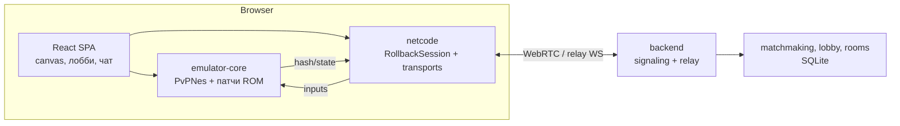

# Battle City PvP

> Online multiplayer for Battle City (NES)

Кооперативно-соревновательная версия классической **Battle City (NES)**: команда
**защитников** (2 танка) обороняет штаб против команды **атакующих** (до 6 танков),
за которых играют реальные игроки или ИИ. Сетевая игра построена на детерминированном
**rollback-netcode** и работает в браузере (WebRTC, с fallback на relay).

Эмулятор **jsnes** и оригинальный ROM рассматриваются как неизменные компоненты:
- jsnes подключён как git-сабмодуль и не редактируется — только подклассы/обёртки;
- ROM грузится как есть, а PvP-логика добавляется патчами **в памяти**, без изменения файла.

## Возможности

- Онлайн-матчи **1v1, 2v2 и до 8 игроков** (2 DEF + 6 ATT), полносвязная транспортная сеть.
- **Rollback-netcode** (GGPO-подход): предсказание, откат, детект рассинхрона.
- **Реконнект** в идущий матч, пауза/возобновление, `desync-recovery` по снапшоту.
- Лобби: создание по коду, слоты команд, готовность, авто-старт, кик, чат (SQLite-история).
- **Spectator**: просмотр матча по ссылке `?spectate=MATCHID`.
- **ИИ** атакующих/защитников (plan / scan / lookahead / strategy) для соло и добора слотов.
- Чат в бою, HUD соединения (ping, rollback, DESYNC), конец матча с возвратом в лобби.
- **Выбор стадии (1–35) с предпросмотром**, **стартовых звёзд защитников (0–3)** и опции **«4★»** (пистолет — супер-оружие, сносящее всё по линии) — из ROM в памяти, старт детерминирован.
- **Звук и музыка** из APU (jsnes) с раздельными громкостью/mute для музыки и эффектов; откаты не дают щелчков.
- Детерминированный `saveState/loadState` и `getFrameHash` — основа побед/поражений и netcode.

## Архитектура



Ключевые инварианты:
- **Детерминизм**: одинаковый вход → одинаковое состояние и `getFrameHash()` на каждом кадре.
- **Неизменный jsnes**: апстрим в `vendor/jsnes`, генерируемая копия `emulator-core/src`, guard-тест.
- **Неизменный ROM**: патчи применяются к in-memory образу PRG (см. `docs/rom-patching.md`).

## Стек

- Эмулятор: jsnes (сабмодуль), надстройка — JavaScript/Node.
- Netcode: бинарный протокол, WebRTC DataChannel + WS-relay.
- Backend: Node.js (`ws`), SQLite.
- Frontend: React + TypeScript + Vite.
- Тесты: `node --test`, Playwright (e2e).

## Быстрый старт

### Docker (проще всего)

1. Положите оригинальный ROM: `rom/original/_battle_city.nes` (см. `rom/original/README.md`).
2. Соберите и запустите:

```bash
docker build -t battle-city-pvp .
docker run --rm -p 8080:8080 battle-city-pvp
# http://localhost:8080
```

### Локально (dev)

```bash
git submodule update --init vendor/jsnes    # неизменный эмулятор (обязателен)
node scripts/prepare.mjs                    # emulator-core/src + ROM-артефакты

# backend
cd backend && npm install && npm start      # http://localhost:8080

# frontend (Vite dev)
cd frontend && npm install && npm run dev
```

## Тесты

```bash
node scripts/prepare.mjs        # подготовка (нужен оригинальный ROM)

cd emulator-core && npm test    # детерминизм, патчинг ROM, PPU, ИИ
cd netcode       && npm test     # rollback, потери, реконнект, desync
cd backend       && npm test     # лобби, комнаты, чат, сигналинг
cd qa            && npm test     # ASM-патчи, sync-mode, нагрузка
cd frontend      && npm test     # фронт-модули

# браузерный e2e онлайн-матча (Playwright)
cd qa && npx playwright install chromium && npm run e2e:online
```

Полный локальный прогон: `bash scripts/ci.sh`. Проверка окружения: `bash scripts/verify-environment.sh`.

> ROM-зависимые тесты требуют `rom/original/_battle_city.nes`. В публичном CI они не
> запускаются (ROM не распространяется).

## Структура репозитория

```
backend/         Node backend: matchmaking, лобби/комнаты, signaling relay, SQLite
emulator-core/   ядро: PvPNes (поверх неизменного jsnes), patching/, ai/, sim/, model/, io/
netcode/         rollback-netcode: протокол, сессия, транспорты (webrtc/relay/local)
frontend/        React/TS SPA (Vite): canvas, лобби, чат, spectator, HUD
qa/              node-тесты + Playwright e2e
rom/             original/ (ваш ROM; не коммитится) + генерируемый disasm/
scripts/         prepare.mjs, extract-patches.mjs, ci.sh, verify-environment.sh, init-git.sh
docs/            документация (см. раздел «Документация»)
vendor/jsnes/      git-сабмодуль: неизменный апстрим jsnes (Apache-2.0)
vendor/nes-disasm/ git-сабмодуль (sparse): справочный дизассемблер Battle City
```

## Обновление jsnes

```bash
cd vendor/jsnes && git fetch && git checkout <commit>
cd ../.. && node scripts/prepare.mjs     # перегенерирует emulator-core/src
cd emulator-core && npm test             # guard-тест сверит байты с апстримом
```

При обновлении сверьте override в `emulator-core/ppu-ext.js` (там скопирован один метод
upstream с точечным исправлением 8x16-спрайтов).

## Подготовка к публикации (git)

```bash
bash scripts/init-git.sh
git remote add origin git@github.com:<user>/<repo>.git
git push -u origin main
```

## Документация

- [docs/getting-started.md](docs/getting-started.md) — сборка, запуск, окружение.
- [docs/architecture.md](docs/architecture.md) — архитектура и компоненты.
- [docs/multiplayer.md](docs/multiplayer.md) — лобби, матчмейкинг, реконнект, spectator.
- [docs/netcode-protocol.md](docs/netcode-protocol.md) — бинарный протокол и rollback.
- [docs/rom-patching.md](docs/rom-patching.md) — неизменный ROM и in-memory патчи.
- [docs/emulator-api.md](docs/emulator-api.md) — API ядра (PvPNes).
- [docs/audio.md](docs/audio.md) — звук и музыка (APU, громкость, откаты).
- [docs/ai.md](docs/ai.md) — ИИ атакующих/защитников.
- [docs/asm-label-map.md](docs/asm-label-map.md) — карта меток ROM.

## Лицензия и правовой статус

- Код проекта — **Apache-2.0** (см. `LICENSE`, `NOTICE`).
- jsnes — Apache-2.0 (сабмодуль `vendor/jsnes`).
- Дизассемблер (`vendor/nes-disasm`) — сторонний репозиторий без указанной лицензии,
  подключён только сабмодулем как справка; его содержимое не перепубликуется.
- **ROM Battle City не распространяется.** Нужна своя легальная копия. Патчи применяются
  только в памяти и не содержат ROM.
- «Battle City» — товарный знак Bandai Namco. Проект неофициальный, некоммерческий,
  не аффилирован с правообладателем.
- **Не публикуйте Docker-образы с ROM** в открытых реестрах. Подробнее — `THIRD_PARTY.md`.
